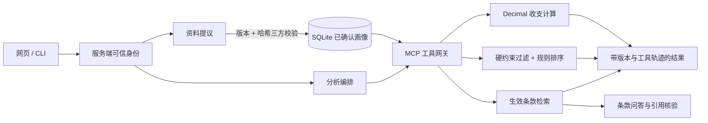

# FinScope：用户画像驱动的金融需求分析 Agent

[](https://github.com/fangyunok/finscope-agent/actions/workflows/ci.yml)
[](https://github.com/fangyunok/finscope-agent/blob/main/pyproject.toml)

**面向财经业务的金融助手 Agent：确认式跨会话 Memory → MCP 工具链 → 确定性收支计算 → 硬约束过滤与规则排序 → 带来源的条款问答。**

把「用户确认的跨会话画像、确定性收支计算、模拟产品约束匹配、带来源的条款检索」串成一条可复现的 Agent 链路：**资料先确认再写入**，金额由 Decimal 程序计算，产品先过硬约束再排序，条款回答必须逐字回指来源。画像的修改、删除与跨用户隔离全部由业务服务在 SQLite 写事务内控制——模型既不参与数值计算，也不能自行确认资料或指定登录身份。

单机可复现部署，随附完整合成数据集（20 个用户画像 / 9 条模拟产品 / 54 条条款），安装后无需任何外部服务即可跑通全链路。本地 Windows / Python 3.12 通过 **100 项测试**，20 组独立模拟跨会话序列 **20 / 20 通过**；跨平台结果以顶部 CI 链接为准。


## 先看结论

| 能力 | 实现与口径 |
| --- | --- |
| 确认式跨会话 Memory | 资料先落为**提议**（含基础版本、内容摘要、字段差异与来源），确认时用 `proposal_id` + 当前画像版本 + 64 位内容哈希三方校验，并在写事务内重新核对；成功后画像版本 +1、写入字段级来源；重建服务实例后按同一版本读回 |
| 删除与并发写回阻断 | 删除递增 `memory_epoch`，持旧代次的在途分析与待确认提议在完成时被拒绝；旧 `run_id` 返回 404。序列评测中的 `memory_delete` / `stale_proposal` / `user_isolation` 用例逐项断言 |
| 幂等与请求复用 | `request_id` 与 输入 / 模式 / 画像版本 / 记忆代次 / 反馈版本 五元组哈希绑定：完全一致才复用同一结果，任一状态变化返回 409，而不是把旧结果当成新条件下的分析 |
| 确定性金额计算 | Decimal 精度 50 位上下文；输入限定非负人民币字符串且 ≤ 2 位小数；达成月数按 `ROUND_CEILING` 向上取整、金额不舍入；结果自带单位、舍入规则与完整假设清单，模型不参与任何数值计算 |
| 计算正确性 | 39 项领域用例覆盖单位、精度、边界与非法输入；Alice 使用预计算标签比对（月结余 `1500.00` 元、目标差额 `7000.00` 元、5 个完整月份），Bob 使用独立的确认约束与候选标签 |
| 产品匹配与排除解释 | 4 项硬约束（金额区间、锁定期 ≤ 目标期限、流动性、风险标签）先于排序执行，应急目标额外附加「仅立即取用」约束；不匹配项返回具体排除原因并挂载对应来源条款 |
| 规则排序 | `rule-baseline-v1`：目标契合 40 / 流动性契合 30 / 期限契合 20 / 风险契合 10 / 费用惩罚 ≤ 10，权重为版本化设计配置并随结果一并返回，同分按 `product_id` 升序；模型不能调整权重或改写分数 |
| 条款检索与版本治理 | 生效日期过滤先于检索；同一 `product_id` 出现多条生效版本时统一标记 `version_conflict` 并整体排除，跨产品重名 `term_id` 标记 `ambiguous_term_id` 拒绝解析；每条命中返回 `term_id`、版本与生效区间 |
| 引用核验 | 模型答复必须同时通过结构与逐字双重校验：`answer_quote` 出现在 `answer` 中、`source_quote` 出现在被引条款原文中、`term_id` 来自本次检索结果；任一不符整体拒绝并返回 502 |
| MCP 工具链 | 5 个工具（`get_my_profile` / `calculate_financial_goal` / `match_products` / `search_financial_terms` / `propose_profile_update`）经真实 MCP Client / Server 协议调用；身份绑定服务端上下文，工具参数走白名单校验，默认 15 s 超时，超时与协议错误分别映射为 504 / 502 |
| 服务化与安全 | Starlette ASGI 服务 + 内置网页工作台；登录签发 HMAC 签名 HttpOnly Cookie，请求经同源中间件校验，正文上限 32 KiB；服务默认只监听回环地址 |
| 工程交付 | Ubuntu / Windows × Python 3.11 / 3.12 CI 矩阵覆盖依赖安装、全部测试、打包数据一致性、wheel 构建与源码目录外安装、`demo`、20 组序列与真实 HTTP smoke；wheel 内 15 个 Python 模块 + 3 个 JSON 与源码逐字节一致，仅需 38 项锁定依赖 |
| 自动化测试 | **100 项通过**（领域 39 / 记忆与业务 27 / Agent 与模型协议 19 / ASGI 网页 13 / 序列与打包 2），**20 / 20** 组模拟跨会话序列通过，执行 83 次真实 MCP 调用、0 次模型调用 |

## 系统架构



分层职责、确认事务、删除语义与工具约束见[架构与数据边界](docs/ARCHITECTURE.md)。

## 快速开始

需要 Python 3.11 或 3.12。首次安装会从包索引下载依赖。

Windows PowerShell：

```powershell
git clone https://github.com/fangyunok/finscope-agent.git
cd finscope-agent
python -m venv .venv
.\.venv\Scripts\python.exe -m pip install -r requirements.lock.txt
.\.venv\Scripts\python.exe -m pip install -e ".[dev]"
.\.venv\Scripts\python.exe -m finscope doctor --mode fixture
.\.venv\Scripts\python.exe -m finscope serve --mode fixture
```

Linux / macOS：

```bash
git clone https://github.com/fangyunok/finscope-agent.git
cd finscope-agent
python3 -m venv .venv
.venv/bin/python -m pip install -r requirements.lock.txt
.venv/bin/python -m pip install -e '.[dev]'
.venv/bin/python -m finscope doctor --mode fixture
.venv/bin/python -m finscope serve --mode fixture
```

访问 <http://127.0.0.1:7862> 并选择演示用户。登录使用内置演示账号选择器签发 HMAC 会话 Cookie，服务默认只监听回环地址；面向多用户部署时把登录端点替换为外部身份提供方即可，会话校验与业务授权逻辑保持不变。

数据库默认保存到当前工作目录 `runs/finscope.sqlite`，可用 `--db` 或进程环境变量 `FINSCOPE_DB_PATH` 指定路径。种子导入只写入用户目录，不会自动确认任何画像；界面中的示例资料仍需核对后手动确认。

## 演示与检查

```powershell
.\.venv\Scripts\python.exe -m finscope demo --db runs/demo.sqlite --mode fixture
.\.venv\Scripts\python.exe -m finscope evaluate --output runs/evaluation.json
.\.venv\Scripts\python.exe -m unittest discover -s tests -v
.\.venv\Scripts\python.exe -m pip check
.\.venv\Scripts\python.exe -m build --wheel
```

`demo` 覆盖画像提议与确认、通过 MCP 分析、重建服务实例后读取资料、确认期限变更以及删除验证。`evaluate` 在独立临时数据库中执行 20 组预先标注的模拟跨会话序列，逐案例记录步骤与标签满足情况，并统计工具调用、模型调用与合成数据标记；退出码非零表示某项验收不满足。

## 接入 Qwen

`.env.example` 是配置参考；应用只读取**进程环境变量**，不会自动加载 `.env`。密钥与个人数据库请勿提交。

```powershell
$env:FINSCOPE_QWEN_BASE = "http://127.0.0.1:11435/v1"
$env:FINSCOPE_QWEN_MODEL = "qwen3:4b-instruct"
.\.venv\Scripts\python.exe -m finscope doctor --mode qwen
.\.venv\Scripts\python.exe -m finscope serve --mode qwen
```

地址需包含 `/v1`。`doctor` 会检查模型目录与目标模型是否就绪。本地服务可用可选变量 `FINSCOPE_QWEN_KEY` 提供密钥；其他 OpenAI 兼容服务改用 `FINSCOPE_API_BASE` / `_MODEL` / `_KEY` 并选择 `--mode api`。

模型只承担两件事：从明确文本中抽取画像字段补丁、依据给定条款生成带引用的回答。确认画像、指定登录身份、改动计算公式、调整排序权重都不在模型可调用范围内——这些能力只存在于服务端接口，而确认接口不作为模型工具暴露。

## 设计边界

以下是明确的设计取舍，不是待补的缺口：

- **模型权限被显式收窄**。抽取与问答之外的动作一律不通向模型：计算由 `calculations.py` 的 Decimal 运算完成，排序由 `matching.py` 的固定规则完成，画像写入必须先经人工确认接口。因此模型输出中的任何数值都不会进入结果。
- **风险偏好只接受显式确认**。收藏、排除、点击与聊天语气只作为兴趣信号记录，代码中这些行为与风险字段的更新路径是分开的，互不触发。
- **产品目录是合成数据**。9 条模拟产品与 54 条条款由本仓库维护，不含收益率、不接入任何资金操作。替换 `src/finscope/data/catalog.json` 并保持字段结构，即可迁移到自有条款库。
- **引用核验保证的是可追溯性**。逐字校验保证回答片段与被引条款一致、引用 ID 合法，因此结果状态为 `pending_review`（可进入人工核查）。
- **删除作用于应用数据库**。删除会清理该用户的画像、字段来源、历史、提议、反馈与个人运行记录，并递增记忆代次。

更完整的验证范围见[项目状态与验证范围](docs/STATE.md)，评测口径见[评测说明](docs/EVALUATION.md)，后续演进见[演进路线](docs/ROADMAP.md)。

## 工程资料

| 文档 | 内容 |
| --- | --- |
| [架构与数据边界](docs/ARCHITECTURE.md) | 分层、确认事务、删除语义、工具约束 |
| [接口说明](docs/API.md) | HTTP 与 MCP 接口、请求示例 |
| [评测说明](docs/EVALUATION.md) | 测试范围、序列标签、复现命令 |
| [项目状态与验证范围](docs/STATE.md) | 验证清单、数据规模、复现命令 |
| [演进路线](docs/ROADMAP.md) | 检索层、编排层、评测层与服务层的后续方向 |
| [项目描述材料](docs/RESUME_ENTRY.md) | 可核实的项目描述及演示顺序 |

依赖版本锁定在 `requirements.lock.txt`。CI 覆盖 Ubuntu / Windows 与 Python 3.11 / 3.12，并额外检查 wheel 在源码目录之外安装、`demo` 执行与启动 HTTP 服务。代码与模拟数据采用 [MIT License](LICENSE)。
