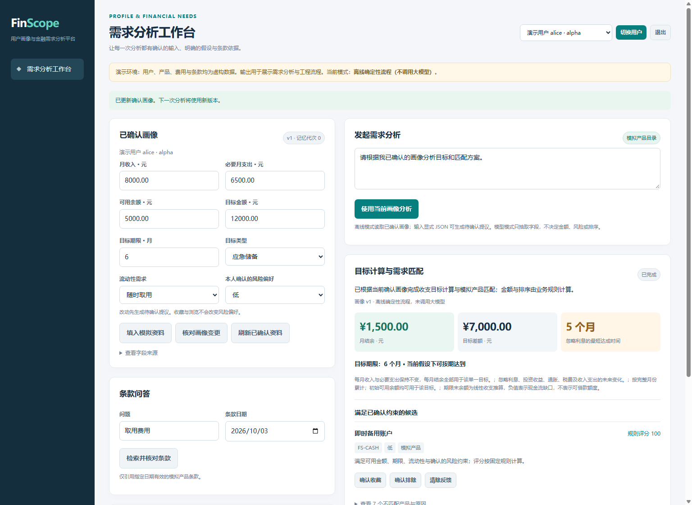

# FinScope：用户画像与金融需求分析平台

[](https://github.com/fangyunok/finscope-agent/actions/workflows/ci.yml)
[](https://github.com/fangyunok/finscope-agent/blob/main/pyproject.toml)

FinScope 把**用户确认的跨会话画像、确定性收支计算、模拟产品约束匹配和带来源的条款检索**连接成可演示的 Python 项目。先确认资料，再使用当前版本分析；修改、删除及不同用户隔离都由业务服务控制。

所有用户、产品、费用和风险标签均为合成演示数据，目录不包含收益率。平台输出是模拟需求分析，没有资金操作。离线 `fixture` 模式运行真实 SQLite 与 MCP 工具调用，使用显式 JSON 解析和规则计算；它没有调用模型。`qwen` / `api` 模式提供可选的模型字段抽取和条款问答接入，真实 Qwen 验证状态见[评测说明](docs/EVALUATION.md)。

本地 Windows / Python 3.12 已通过 **100 项测试**，20 组独立模拟序列全部通过。跨平台结果以顶部 CI 链接为准。



## 能演示什么

- Alice 每月收入 8,000 元、必要支出 6,500 元、现有余额 5,000 元、目标 12,000 元：程序计算结余 1,500 元、差额 7,000 元、至少 5 个完整月份。
- 再次打开会话读取已确认资料；将目标期限改为 3 个月，提交提议、查看差异并确认，新的分析使用新版本。
- 金额、流动性、锁定期和明确的风险偏好在模型之外过滤；同时展示候选和排除原因。
- 收藏与排除仅记录显式兴趣反馈，风险偏好需要单独确认。
- 删除记忆后，资料、提议、反馈和个人运行记录一起清理；下一次分析要求重新提供资料。
- 条款问题展示产品、条款 ID、版本和生效日期。离线模式直接展示检索来源；模型回答核验引用结构，语义支持仍需人工判断。

## 本地运行

需要 Python 3.11 或 3.12。首次安装会从包索引下载依赖。

Windows PowerShell：

```powershell
git clone https://github.com/fangyunok/finscope-agent.git
cd finscope-agent
python -m venv .venv
.\.venv\Scripts\python.exe -m pip install -r requirements.lock.txt
.\.venv\Scripts\python.exe -m pip install -e ".[dev]"
.\.venv\Scripts\python.exe -m finscope doctor --mode fixture
.\.venv\Scripts\python.exe -m finscope serve --mode fixture
```

Linux / macOS：

```bash
git clone https://github.com/fangyunok/finscope-agent.git
cd finscope-agent
python3 -m venv .venv
.venv/bin/python -m pip install -r requirements.lock.txt
.venv/bin/python -m pip install -e '.[dev]'
.venv/bin/python -m finscope doctor --mode fixture
.venv/bin/python -m finscope serve --mode fixture
```

访问 <http://127.0.0.1:7862>，选择演示用户。演示账号选择器用于本机展示，不是生产身份认证。服务默认只监听本机；真实部署需要身份提供方、访问控制与完整运维配置。

数据库默认保存到当前工作目录 `runs/finscope.sqlite`。`--db` 或进程环境变量 `FINSCOPE_DB_PATH` 可以指定路径。种子数据不会自动确认用户画像；界面的示例资料仍需核对并确认。

## 演示与检查

```powershell
.\.venv\Scripts\python.exe -m finscope demo --db runs/demo.sqlite --mode fixture
.\.venv\Scripts\python.exe -m finscope evaluate --output runs/evaluation.json
.\.venv\Scripts\python.exe -m unittest discover -s tests -v
.\.venv\Scripts\python.exe -m pip check
.\.venv\Scripts\python.exe -m build --wheel
```

`demo` 包含画像提议与确认、通过 MCP 分析、重建服务实例后读取资料、确认期限变更以及删除验证。`evaluate` 使用独立临时数据库执行 20 组预先标注的模拟跨会话序列。退出码非零表示某项验收不满足。

## 接入 Qwen

`.env.example` 是配置参考；应用只读取**进程环境变量**，不会自动加载 `.env`。不要提交密钥或个人数据库。

```powershell
$env:FINSCOPE_QWEN_BASE = "http://127.0.0.1:11435/v1"
$env:FINSCOPE_QWEN_MODEL = "qwen3:4b-instruct"
.\.venv\Scripts\python.exe -m finscope doctor --mode qwen
.\.venv\Scripts\python.exe -m finscope serve --mode qwen
```

地址应包含 `/v1`。`doctor` 检查模型目录与目标模型是否存在，不证明生成质量。可选 `FINSCOPE_QWEN_KEY` 在本地设置。其他兼容服务使用 `FINSCOPE_API_BASE` / `MODEL` / `KEY` 并选择 `--mode api`。

模型仅抽取明确资料和生成带引用的条款答复，不能确认画像、指定登录身份、改变计算公式或绕过产品约束。固定编排选择工具；项目没有声称实现自主规划、多智能体或经过训练的排序模型。

## 工程资料

| 文档 | 内容 |
| --- | --- |
| [架构与数据边界](docs/ARCHITECTURE.md) | 分层、确认事务、删除语义、工具约束 |
| [接口说明](docs/API.md) | HTTP 与 MCP 接口、请求示例 |
| [评测说明](docs/EVALUATION.md) | 测试范围、标签、局限与真实模型状态 |
| [面试与简历材料](docs/RESUME_ENTRY.md) | 可核实的项目描述及演示顺序 |

依赖版本锁定在 `requirements.lock.txt`。CI 配置覆盖 Ubuntu / Windows 与 Python 3.11 / 3.12，并检查 wheel 在源码目录之外安装、演示和启动 HTTP 服务。代码与模拟数据采用 [MIT License](LICENSE)。
