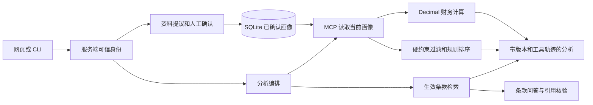

# 架构与数据边界

FinScope 的核心边界是「资料先确认、计算由程序执行、产品先满足约束、来源可检查」。

## 各层职责

`service.py` 管理身份、画像、提议、反馈和分析记录。`database.py` 提供 SQLite 事务。`calculations.py` 对人民币金额字符串执行 Decimal 运算：金额最多两位小数，达成月数向上取整，计算明确忽略利息与未来收支变化，并随结果返回单位、舍入规则与假设清单。`catalog.py` 对当前模拟条款执行日期过滤、结构校验和条款检索；`matching.py` 执行产品硬约束和规则评分。

`tools.py` 使用 MCP 服务端与客户端进行实际协议调用，登录身份绑定在服务端上下文中。工具参数不接受其他用户身份。`agent.py` 是可审计的编排，先读取当前确认画像，再计算、匹配和检索；存在新资料时只产生待确认提议。`model.py` 提供显式 JSON 的离线解析器及可选 HTTP 模型适配器。

## 画像确认与来源

每个用户初始版本为 0，资料为空。示例用户数据包含待使用的 `demo_profile`，种子导入只写入用户目录。

资料变化先保存为提议，包括基础版本、内容摘要、字段差异与来源。确认请求需要对应的提议 ID、当前画像版本、内容哈希和显式确认。事务重新检查用户、版本及提议状态，成功后生成新画像版本和字段来源。过期提议不能覆盖更新后的资料。

用户本次确认的信息会成为新的当前版本。浏览、收藏和排除作为兴趣信号记录，与风险偏好字段的更新路径相互独立。风险标签只在明确提供并人工确认后参与约束。

## 隔离、删除与并发

个人记录按服务端可信用户身份读取。跨用户的提议和分析 ID 不可访问。模型生成的 JSON 经过严格字段校验，不能插入用户 ID 或私自确认资料。

删除操作清理用户的已确认资料、字段来源、提议、反馈以及个人分析记录，并递增用户的记忆代次。已经启动的旧分析和提议持有旧代次，完成时会被阻止写回。因此删除后的新会话不能复用先前的画像或个人分析。公开模拟产品与演示账号作为共享目录保留。

SQLite 使用写事务进行画像确认和删除；画像版本、记忆代次与业务约束同时参与校验。显式反馈实际发生变化时递增 `feedback_version`，同时使正在运行的旧分析失效；完成分析时再次检查反馈快照。因此用户已排除的产品不会被尚未完成的旧分析重新写入当前结果。

相同请求 ID 只有在输入、模式、画像版本、记忆代次与反馈版本一致时才复用同一次分析结果。任一输入状态变化需要新请求 ID，旧结果不会被当作新条件下的分析。

## 产品和条款

产品目录是明确标注的合成数据。有效日期过滤发生在检索与匹配之前；同一 `product_id` 出现多条生效版本时统一标记 `version_conflict`，跨产品重名 `term_id` 标记 `ambiguous_term_id`，两类记录都不进入匹配与条款解析。

规则评分只对通过硬约束的候选执行，权重以版本化配置随结果一并返回。候选包含来源条款；不匹配产品包含具体排除原因。

检索阶段执行词项与字符匹配，命中携带 `term_id`、版本与生效区间。条款问答的模型引用校验检查来源 ID、引用原文、回答片段和版本，用以确认引用结构合法且文字可追溯；结果状态为 `pending_review`，进入人工核查环节。

## 运行边界

平台输出是需求分析结果，不接入支付、交易或真实产品销售。默认使用本机演示账号选择器和回环监听地址；面向多用户部署时接入外部身份提供方、访问控制、数据生命周期与备份策略，业务服务与工具层保持不变。

后续演进方向见[演进路线](ROADMAP.md)。
